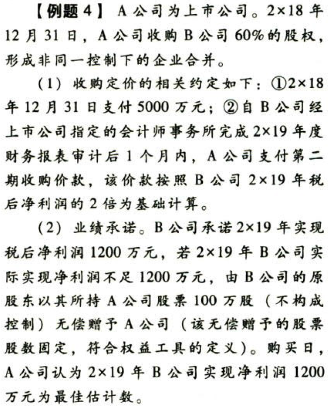

企业合并.本章真题

# 1. 题目

【答案】
[查看解析和答案](media/35887d8c9dc53fd156648fd8bf3020f0.png.md)
# 2. 题目

【答案】
[查看解析和答案](media/1a7b78fb1256601753e7a8e30c035341.png.md)
# 3. 题目

# 4. 题目

【答案】
[查看解析和答案](media/35e3626af7022eae738ea93cf34431be.png.md)
# 5. 题目

【答案】
[查看解析和答案](media/0df3bcc0d16421cd0ee94f3f612c2281.png.md)

