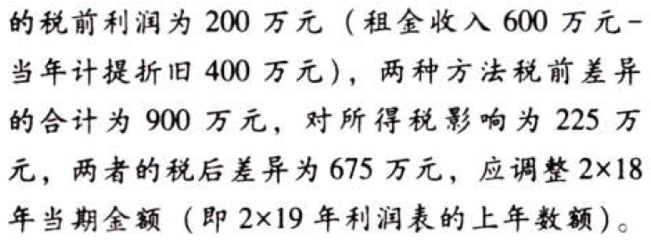
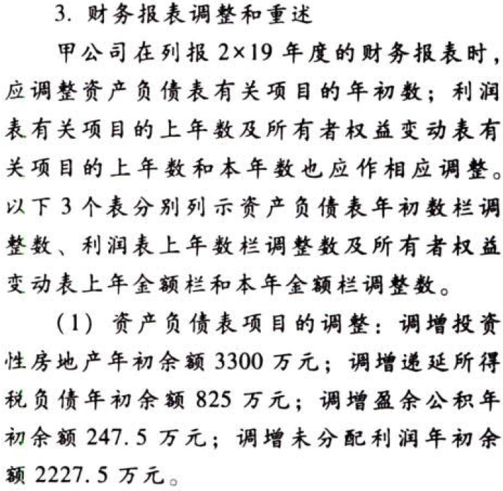

会计政策和估计.本章真题

# 1. 题目

【答案】
[查看解析和答案](media/59dcc96a7a2d887606cb162828c623e2.png.md)
# 2. 题目

【答案】
[查看解析和答案](media/a952a518e12a6915194a5f9ad0541291.png.md)
# 3. 题目

【答案】
[查看解析和答案](media/562cf9ef23e197bac45af33aa870fa01.png.md)
# 4. 题目

# 5. 题目

【答案】
[查看解析和答案](media/2bcf1872d056923329afae09de1ae427.png.md)
# 6. 题目

【答案】
[查看解析和答案](media/55d6e7dcc53293ea09d7b752eff8f270.png.md)
# 7. 题目

【答案】
[查看解析和答案](media/73bdbc1ad32aed3f71f68a40f03e1f39.png.md)
# 8. 题目

【答案】
[查看解析和答案](media/4c122a585487b6b10715eaf847d00f61.png.md)

