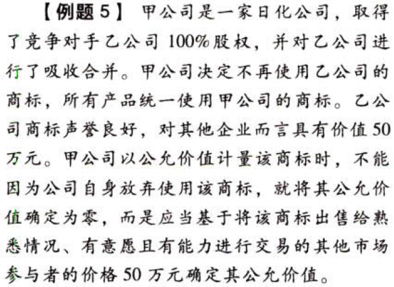

公允价值计量.本章真题

# 1. 题目

# 2. 题目

# 3. 题目

【答案】
[查看解析和答案](media/d8869111a3ae7949d89f30d94b09d6b9.png.md)
# 4. 题目

# 5. 题目

# 6. 题目

# 7. 题目

【答案】
[查看解析和答案](media/df09452592744bcdc1f4104d842c6f0a.png.md)
# 8. 题目

【答案】
[查看解析和答案](media/dfa71614f346a5149ff4b4df846ed8de.png.md)
# 9. 题目

【答案】
[查看解析和答案](media/adf18d1365db97fe15b86eebcdbbc55d.png.md)

