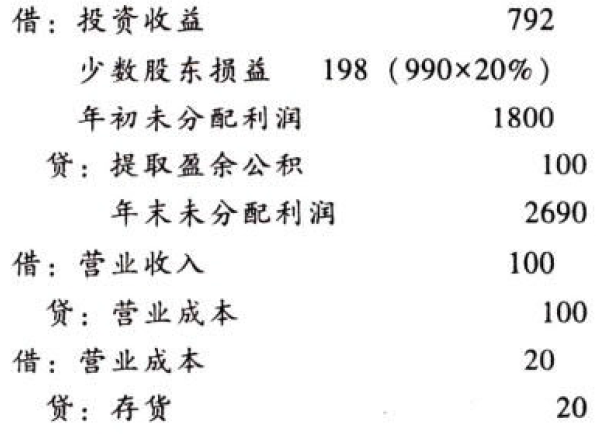
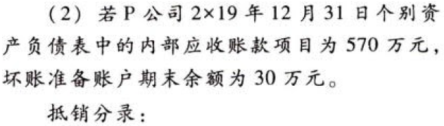
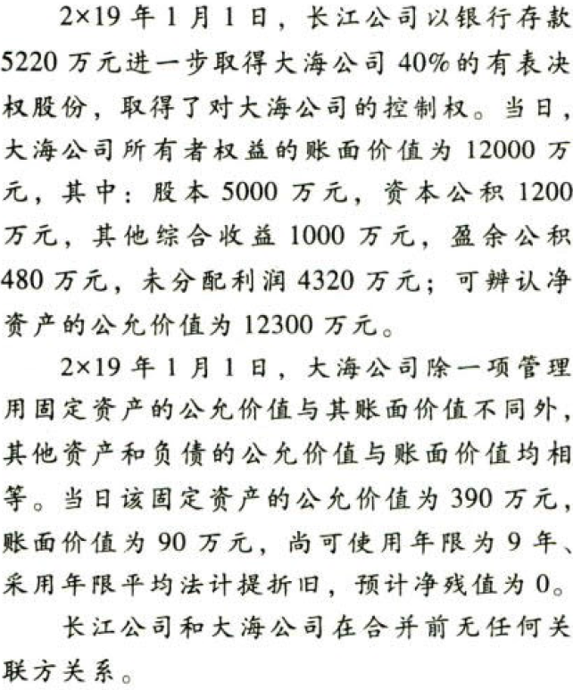
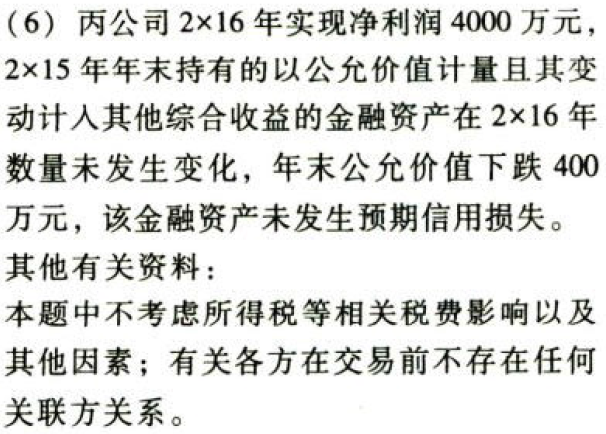

合并财务报表.本章真题

# 1. 题目

【答案】
[查看解析和答案](media/eb5bd2ab3c81ea99e961bdfc57cc95e6.png.md)
# 2. 题目

【答案】
[查看解析和答案](media/1f2dd89f2e43a1d4bd033f7a2e69a62f.png.md)
# 3. 题目

【答案】
[查看解析和答案](media/6e63746e4993af3a7e39d41670e68bba.png.md)
# 4. 题目

【答案】
[查看解析和答案](media/230a489c9beae6faeb804b2f735ef513.png.md)
# 5. 题目

【答案】
[查看解析和答案](media/1646af448739c188f1787a61bce69ee4.png.md)
# 6. 题目

【答案】
[查看解析和答案](media/5160a88a156c19adbc94f6f30a8e243a.png.md)
# 7. 题目

【答案】
[查看解析和答案](media/facf9e1cdd0543898c55c37a92c89bbe.png.md)
# 8. 题目

【答案】
[查看解析和答案](media/900c66ad005ab154a0f03218d51116b0.png.md)
# 9. 题目

【答案】
[查看解析和答案](media/7d96970fb101177a6cdbbf9c14e7529f.png.md)
# 10. 题目

【答案】
[查看解析和答案](media/3e9e012c94ac93c40c22bfa04f80a38c.png.md)
# 11. 题目

【答案】
[查看解析和答案](media/7804c2b1156a7ae71bebf49d045a2804.png.md)
# 12. 题目

# 13. 题目

【答案】
[查看解析和答案](media/b107a513176a84ee5e0b5dc4bcd07a1b.png.md)
# 14. 题目

【答案】
[查看解析和答案](media/bece314e11fbdff13e4e4450d6446133.png.md)
# 15. 题目

【答案】
[查看解析和答案](media/1106d8badd37465f9c5581be16ebfe72.png.md)
# 16. 题目

【答案】
[查看解析和答案](media/6fe562a27159a33479a1d66b018c218a.png.md)
# 17. 题目

【答案】
[查看解析和答案](media/1427a346d6972b5bf6cb1493b8e5ed3e.png.md)
# 18. 题目

【答案】
[查看解析和答案](media/77067bcde137d99fb8d4f2683a5d9ebc.png.md)
# 19. 题目

【答案】
[查看解析和答案](media/c52e7c9807d29bb3fe3b17dafe035282.png.md)
# 20. 题目

【答案】
[查看解析和答案](media/c3c3198a474a91f8cc5f463e809582fa.png.md)
# 21. 题目

【答案】
[查看解析和答案](media/974fdfc8e0d0f06afe1babaff77c5564.png.md)
# 22. 题目

【答案】
[查看解析和答案](media/bff3afae6ca27f22c2be952a6982ef14.png.md)
# 23. 题目

【答案】
[查看解析和答案](media/4e3050e8946baa892827f5d9311dd50b.png.md)
# 24. 题目

【答案】
[查看解析和答案](media/763615a85b18699716c32a3f0831a6c7.png.md)
# 25. 题目

【答案】
[查看解析和答案](media/a34f02865483f39353d4d0478f13d212.png.md)

