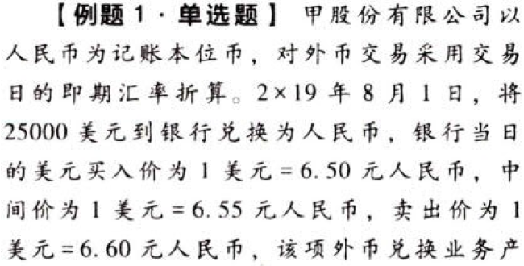
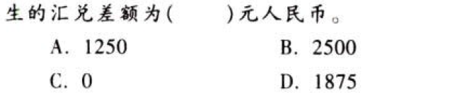

外币折算.本章真题

# 1. 题目

【答案】
[查看解析和答案](media/44af2c64acee0bbbf1b408f9c8c5f485.png.md)
# 2. 题目

【答案】
[查看解析和答案](media/c4120e81303753936c53f05b238f8af2.png.md)
# 3. 题目

【答案】
[查看解析和答案](media/fb471378ed31934291a9efcccfce7684.png.md)
# 4. 题目

【答案】
[查看解析和答案](media/a1f1caedb58e61a8e2826d1d701337fe.png.md)
# 5. 题目

【答案】
[查看解析和答案](media/e73dd3737b92854b108891e5632e42d8.png.md)
# 6. 题目

【答案】
[查看解析和答案](media/d0eb998919f87265ff79d2359e6415b8.png.md)

