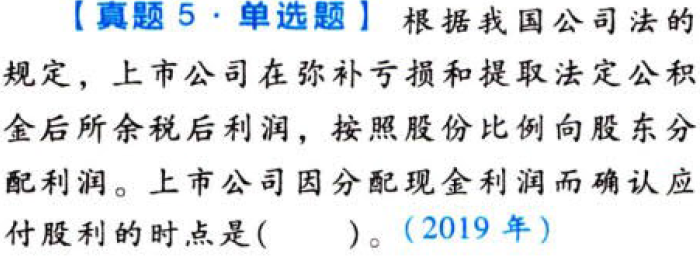

所有者权益.本章真题

# 1. 题目

【答案】
[查看解析和答案](media/2e47cf27d5e0c0c7983f42c69c12c3ba.png.md)
# 2. 题目

【答案】
[查看解析和答案](media/7951ae52e9c2c95eaa062caa04213ad8.png.md)
# 3. 题目

【答案】
[查看解析和答案](media/0432d99bb1520565dae5d8181ebc9ba1.png.md)
# 4. 题目

【答案】
[查看解析和答案](media/0c5c6271d4dc3b5bd75781ddc0a0328d.png.md)
# 5. 题目

【答案】
[查看解析和答案](media/ae5a9b498de26bc19852888dc1ee954b.png.md)
# 6. 题目

【答案】
[查看解析和答案](media/db61fe2c59ffe7d72285afe50d35098c.png.md)
# 7. 题目

【答案】
[查看解析和答案](media/afd15c79ae37ebceb5a57d2337a83a64.png.md)

