收入.本章真题

# 1. 题目

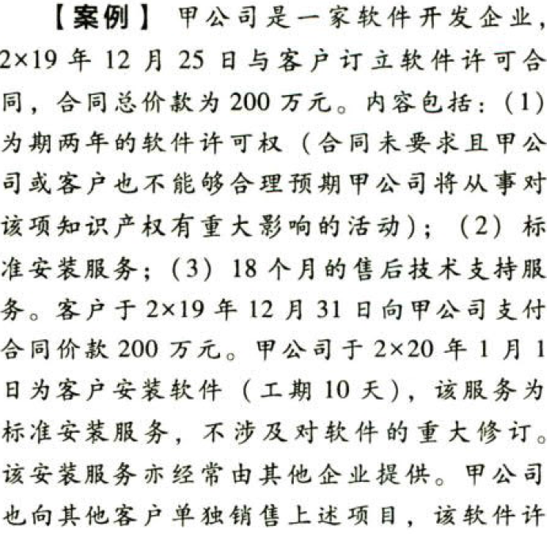

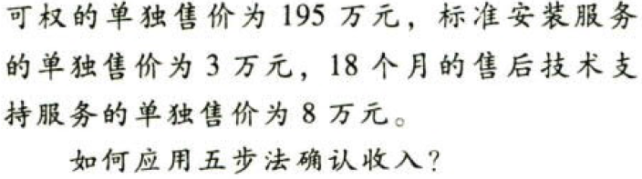

【答案】
[查看解析和答案](media/c4f8455dcd451b262234a1eaeca85194.png.md)
# 2. 题目

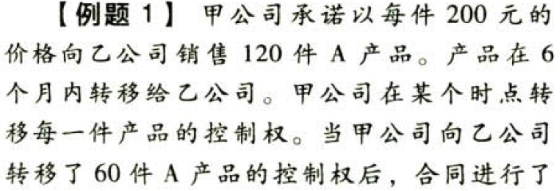

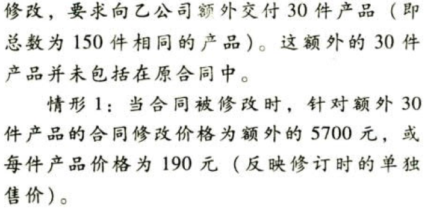

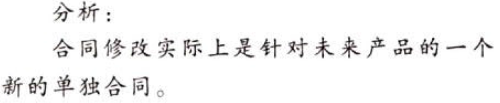

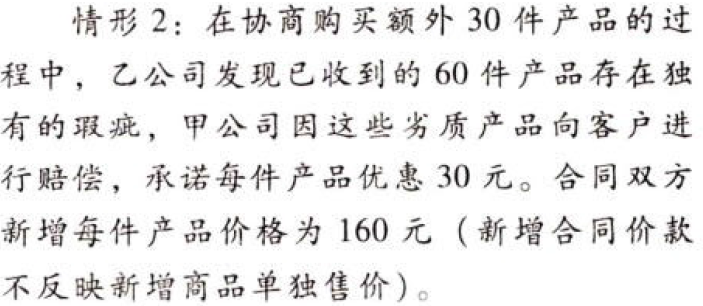

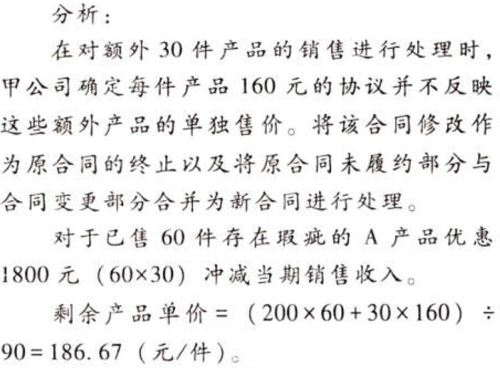

# 3. 题目

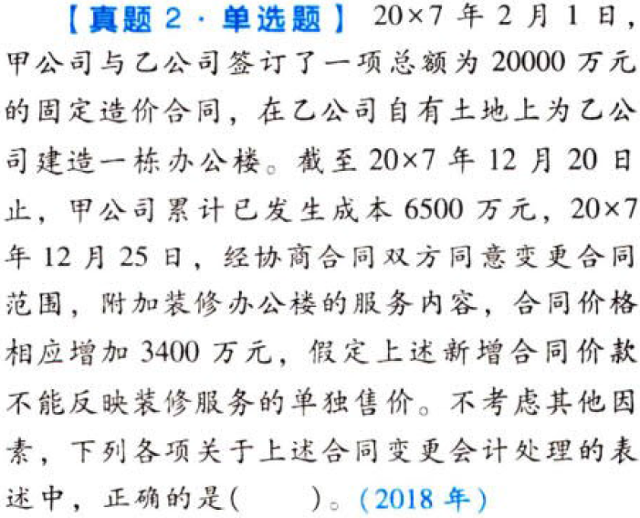

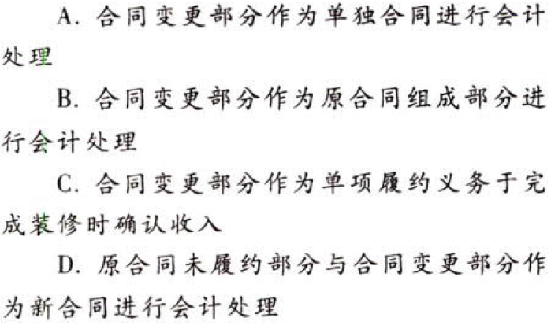

【答案】
[查看解析和答案](media/3b14bee892dde4dc4d7aaaaad804cd81.png.md)
# 4. 题目

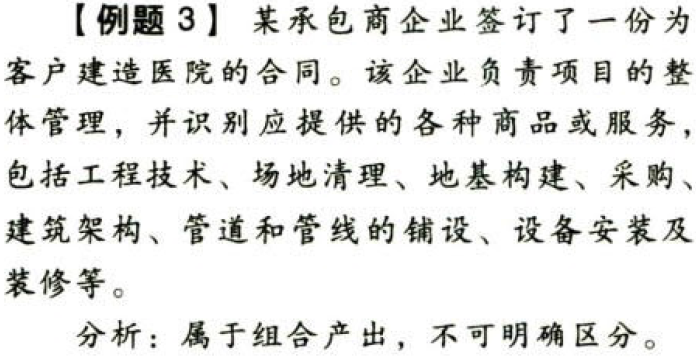

# 5. 题目

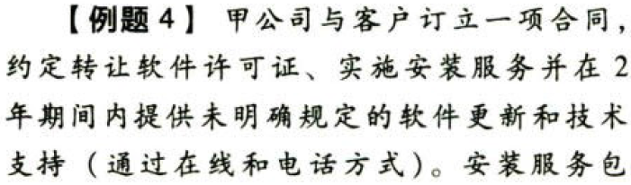

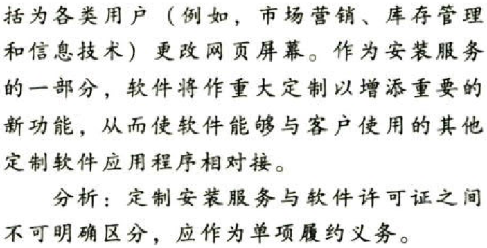

# 6. 题目

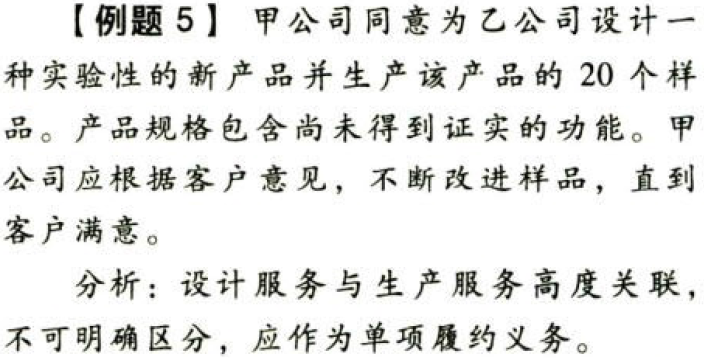

# 7. 题目

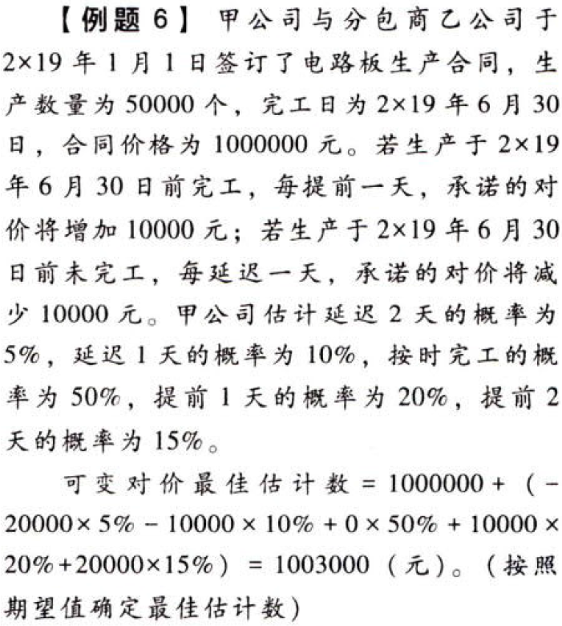

# 8. 题目

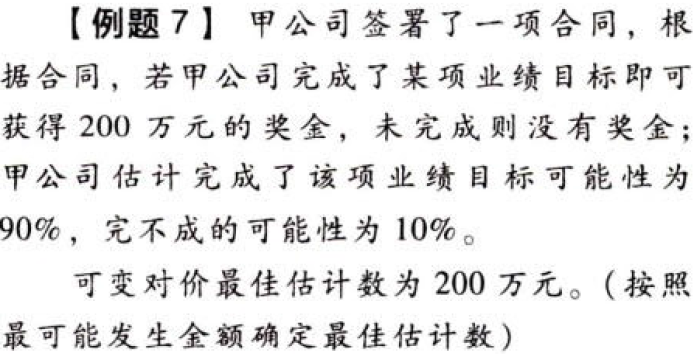

# 9. 题目

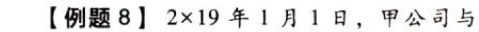

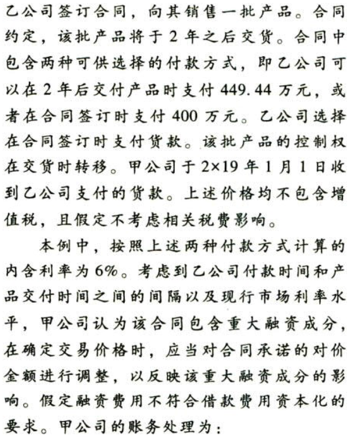

【答案】
[查看解析和答案](media/9d059bc7c40db813f151733d737f1e41.png.md)
# 10. 题目

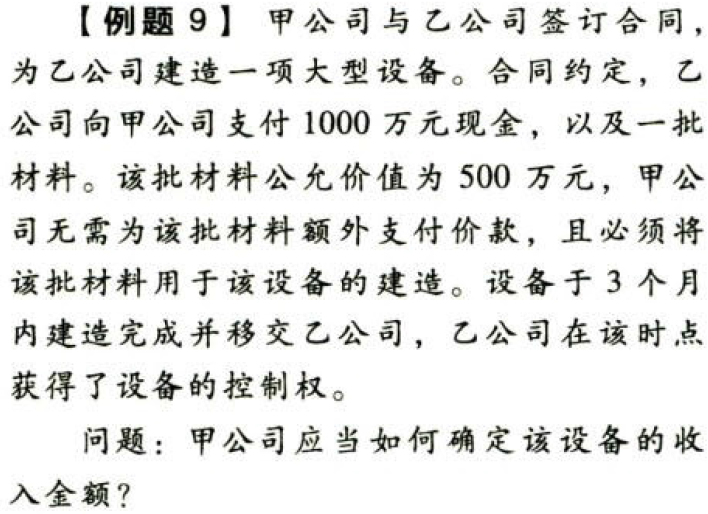

【答案】
[查看解析和答案](media/9802144267b13e151aa93a2061cf830f.png.md)
# 11. 题目

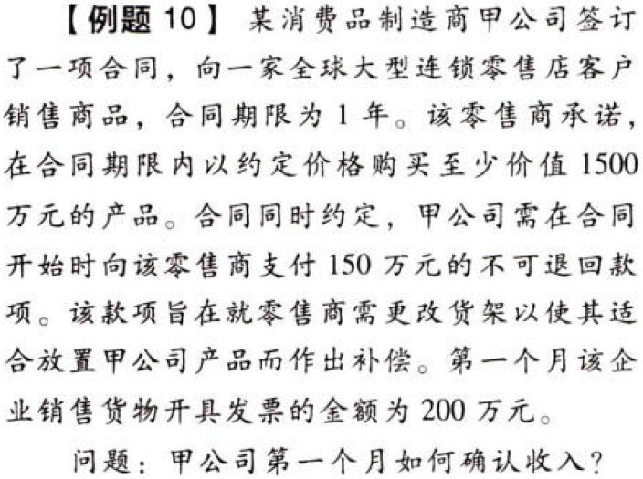

【答案】
[查看解析和答案](media/8cfb799f0ecb1c5dce5a3c7ffb9d419b.png.md)
# 12. 题目

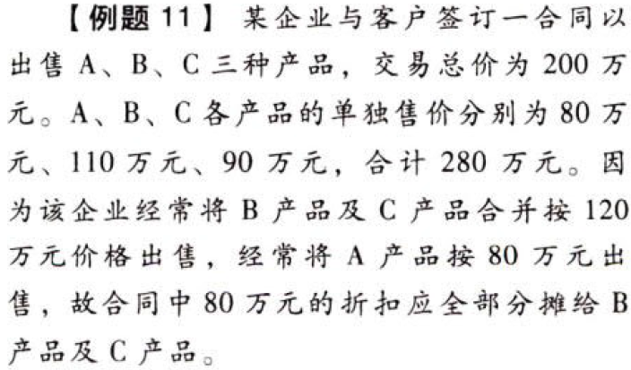

【答案】
[查看解析和答案](media/83c5ae67209f4a1877b8ee8cbd47e47a.png.md)
# 13. 题目

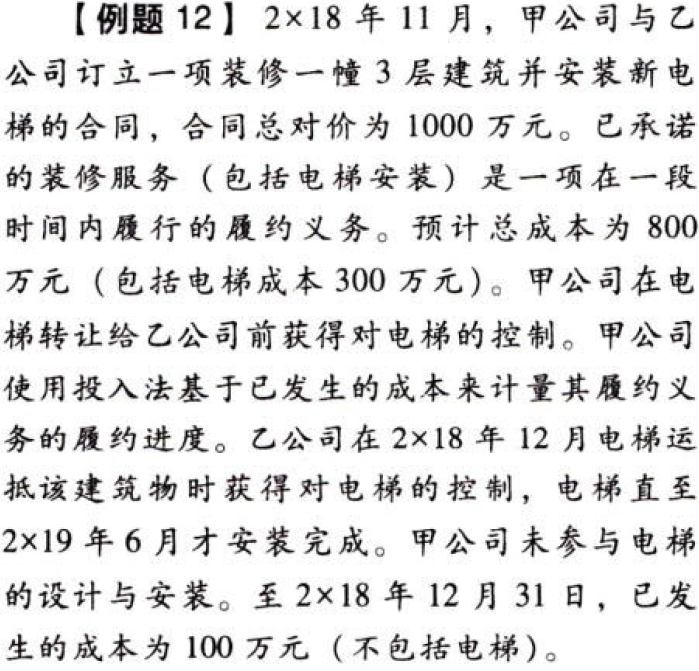

【答案】
[查看解析和答案](media/049b9887277df3f6faba22eca2caf702.png.md)
# 14. 题目

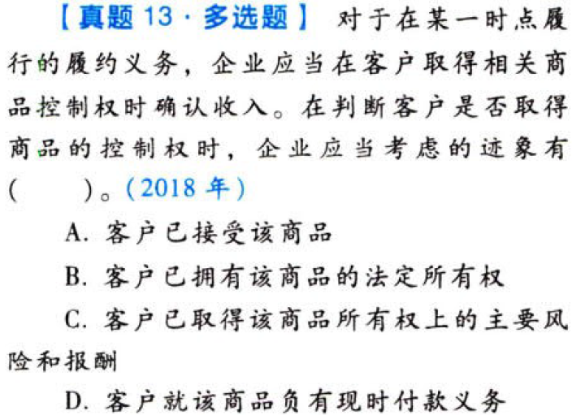

【答案】
[查看解析和答案](media/c68ce5c0dfc18487b4aea4cacf1833c4.png.md)
# 15. 题目

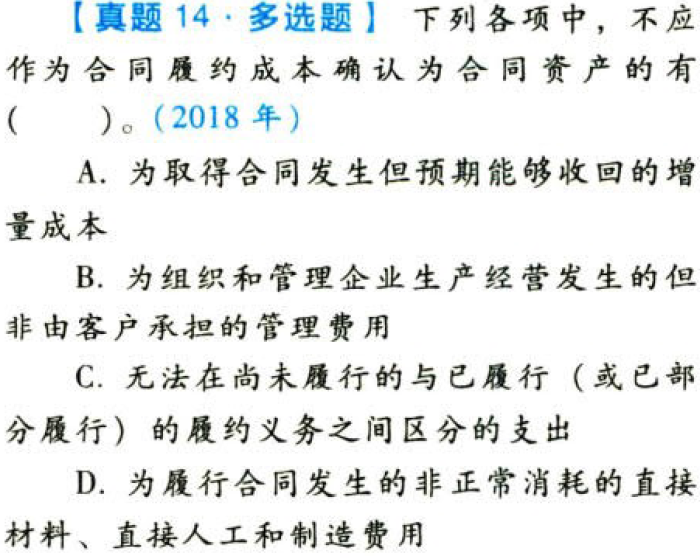

【答案】
[查看解析和答案](media/4fe1743dda99cc606766194cfb1f978c.png.md)
# 16. 题目

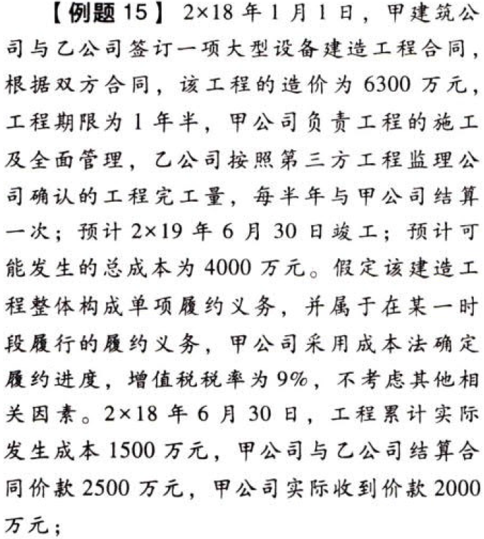

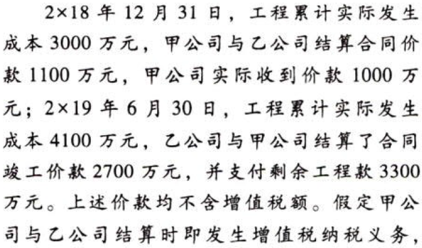

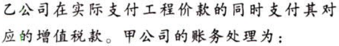

【答案】
[查看解析和答案](media/96108d02f94bb2b54f791df40c8eff89.png.md)
# 17. 题目

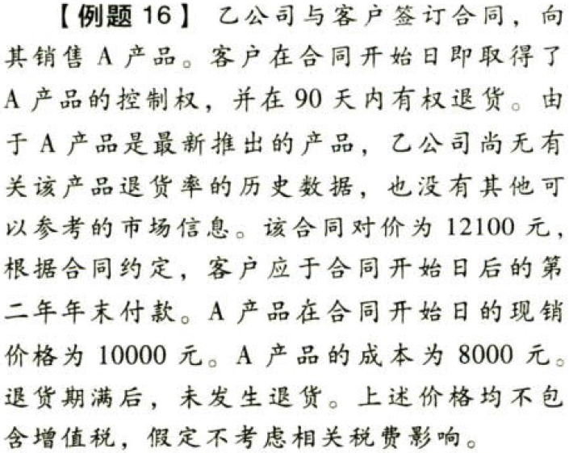

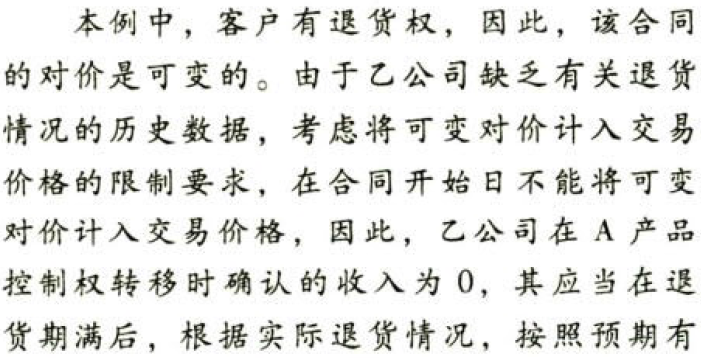

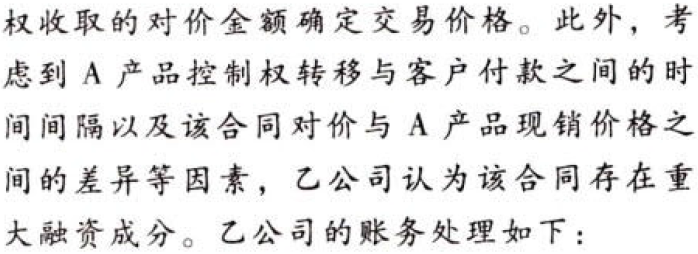

【答案】
[查看解析和答案](media/2a3d17c7c5ad50ec076e584cfdb63a86.png.md)
# 18. 题目

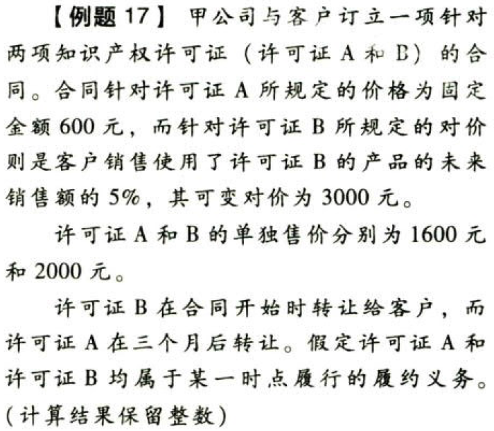

【答案】
[查看解析和答案](media/d13c52e4c984180b55bdd39ba942a2ba.png.md)
# 19. 题目

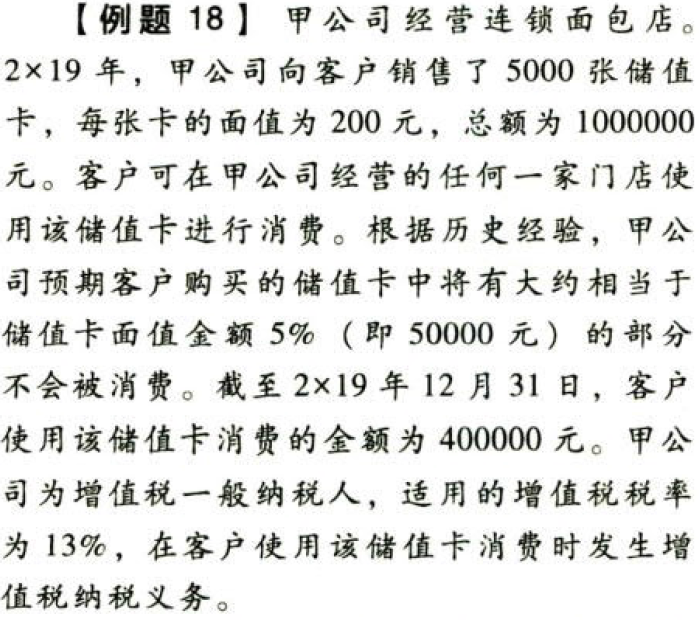

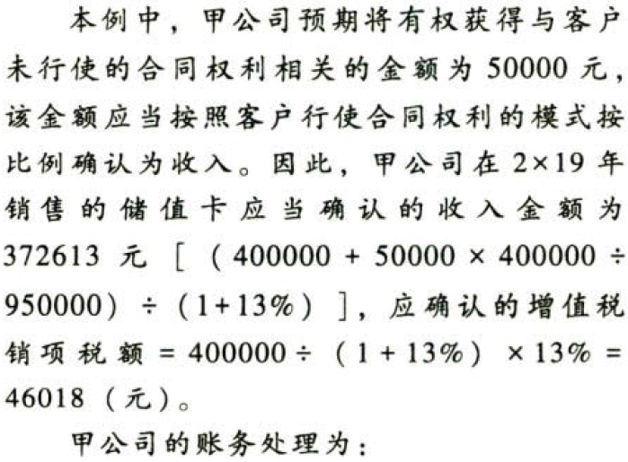

【答案】
[查看解析和答案](media/e87d3bcc6754cb67cf0cf3c44253c0d8.png.md)

