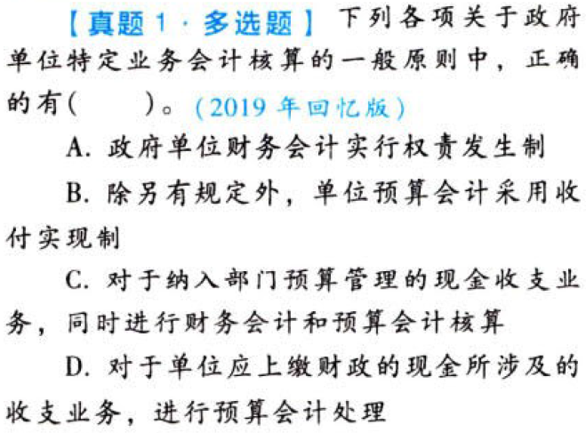
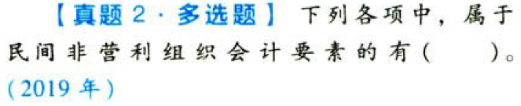
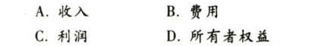
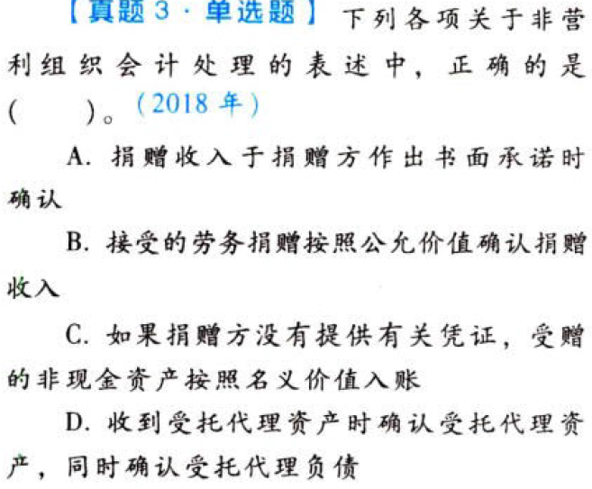
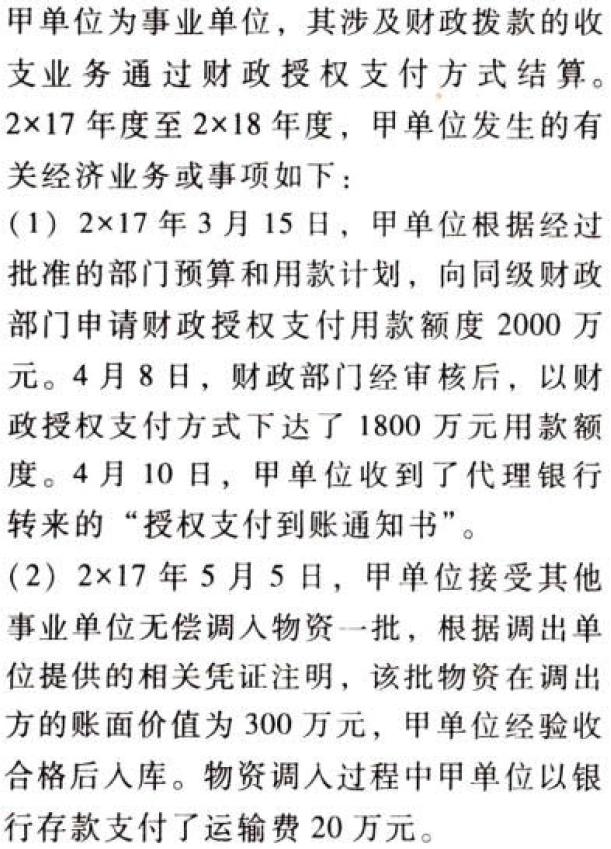
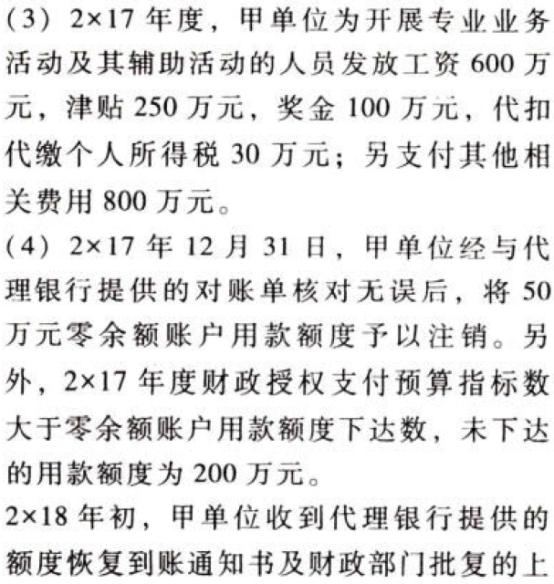
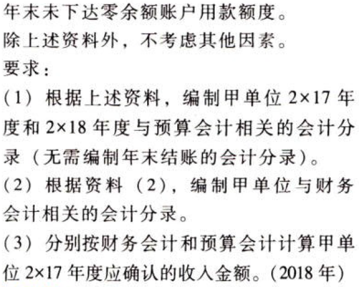

政府及民间非营利组织会计.本章真题

# 1. 题目

【答案】
[查看解析和答案](media/a769a5b42314df3fa609bed88cd58108.png.md)
# 2. 题目

【答案】
[查看解析和答案](media/277430a7fc8830829df7e5bd0ec6c102.png.md)
# 3. 题目

【答案】
[查看解析和答案](media/57ee6465d0d468ffdb4d6b45c7f66476.png.md)
# 4. 题目

【答案】
[查看解析和答案](media/c37f99f541c7dd8ee85fe66b8645e0dc.png.md)

