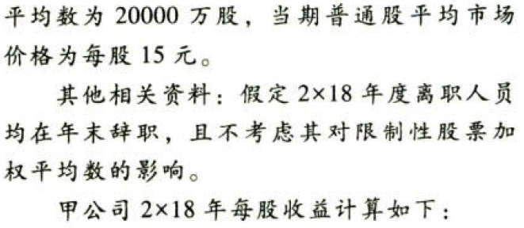
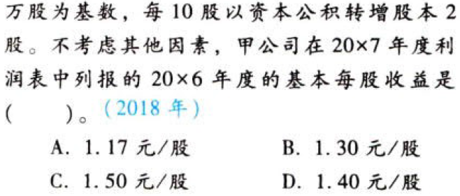

每股收益.本章真题

# 1. 题目

【答案】
[查看解析和答案](media/a32cbac04cba93479bbe9707ca674d37.png.md)
# 2. 题目

【答案】
[查看解析和答案](media/42dac132fef6e054be44f8ecf8979ba7.png.md)
# 3. 题目

【答案】
[查看解析和答案](media/1c5274ea08bafec8f7b21c6596f5194d.png.md)
# 4. 题目

【答案】
[查看解析和答案](media/f43351cd8e92a1ffe10b704ea69ae2d1.png.md)
# 5. 题目

【答案】
[查看解析和答案](media/df03c020d7e76ef2f9bd78fad37ffdbc.png.md)
# 6. 题目

【答案】
[查看解析和答案](media/2afd34537302e94689b79ca40d0f27b2.png.md)
# 7. 题目

