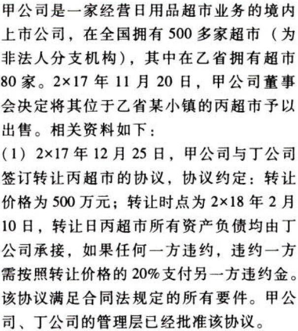

特殊.持有待售的非流动资产、处置组和终止经营.本章真题

# 1. 题目

【答案】
[查看解析和答案](media/9367a10bbe3347a03612eb2df9c2b2cc.png.md)
# 2. 题目

【答案】
[查看解析和答案](media/6306470fb3ccafbee6834dcd444d3a83.png.md)
# 3. 题目

【答案】
[查看解析和答案](media/24bd635417e059bf9428a4d8d57f1c67.png.md)
# 4. 题目

【答案】
[查看解析和答案](media/a8966d5ac2f8906a1b8a4dac841d2153.png.md)
# 5. 题目

【答案】
[查看解析和答案](media/455c51bfb16ebb0bab58613ba83a453d.png.md)
# 6. 题目

【答案】
[查看解析和答案](media/929787d5ffff880e9c8388ba0d1f5eb3.png.md)

