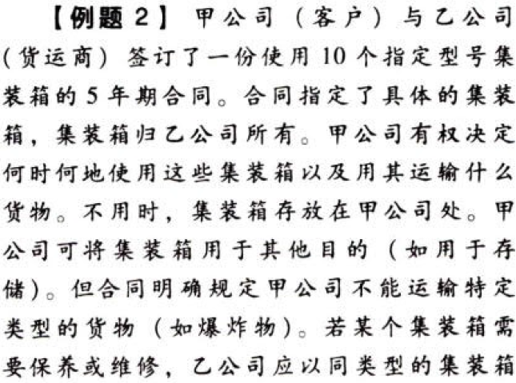
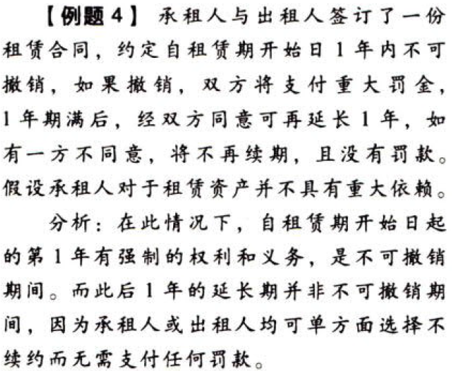

特殊.租赁.本章真题

# 1. 题目

# 2. 题目

# 3. 题目

# 4. 题目

# 5. 题目

# 6. 题目

# 7. 题目

【答案】
[查看解析和答案](media/60abfd68131157ecceb9f05ee2035d15.png.md)
# 8. 题目

【答案】
[查看解析和答案](media/b3e1d6ac0263504fa51d49670c18a6f3.png.md)

