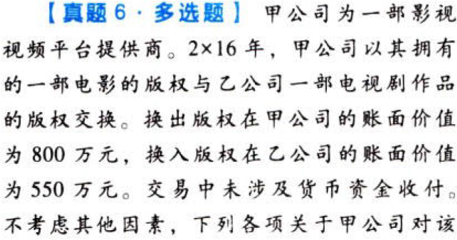

特殊.非货币性资产交换.本章真题

# 1. 题目

【答案】
[查看解析和答案](media/78a45b2c98b01afb194b789dd2bdd6c0.png.md)
# 2. 题目

【答案】
[查看解析和答案](media/a56a2e6cecd1d251322d4782049d720b.png.md)
# 3. 题目

【答案】
[查看解析和答案](media/d819021e51e5e357adc9b22f3a8d91f9.png.md)
# 4. 题目

【答案】
[查看解析和答案](media/7f70e142f1ec7149c957e951c0e51b6f.png.md)
# 5. 题目

【答案】
[查看解析和答案](media/54809ef159ac6efaee07417c43e22dcc.png.md)
# 6. 题目

【答案】
[查看解析和答案](media/52cd7dfafac86676bb9eb84a7f4d4697.png.md)

