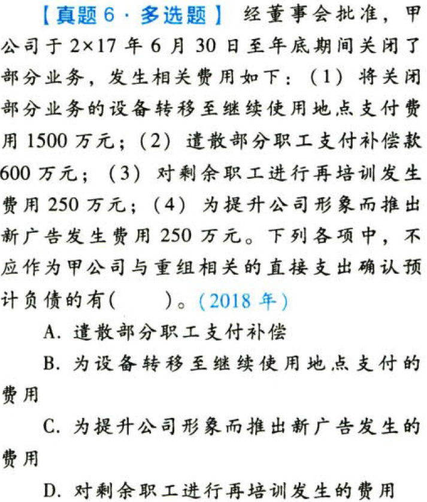
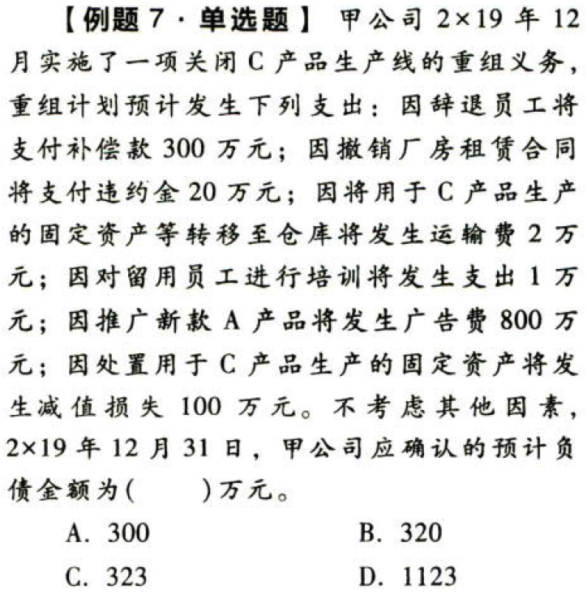

负债.或有事项.本章真题

# 1. 题目

【答案】
[查看解析和答案](media/97e13e81ec22bbc673c09668d614b85f.png.md)
# 2. 题目

【答案】
[查看解析和答案](media/52bf6d8810f193a516c9a2f2814fa9c8.png.md)
# 3. 题目

【答案】
[查看解析和答案](media/199a836c9ecdb9b86b6a0c3f6f544018.png.md)
# 4. 题目

【答案】
[查看解析和答案](media/10902bf4a09459cc9c90695358ce5848.png.md)
# 5. 题目

【答案】
[查看解析和答案](media/cd593be0a6a3c16eb7316f153898953d.png.md)
# 6. 题目

【答案】
[查看解析和答案](media/451dfc082f55cf07de1779cfa5d65c7f.png.md)
# 7. 题目

【答案】
[查看解析和答案](media/a66b7d6ef7ae423c140359336fca35eb.png.md)

