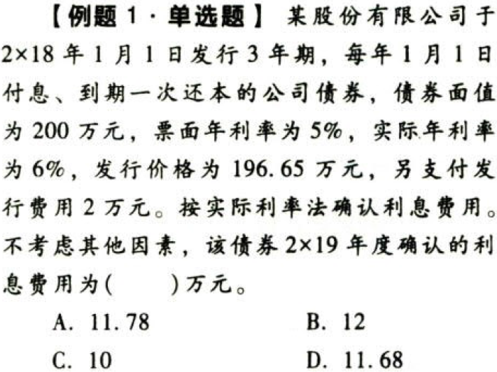
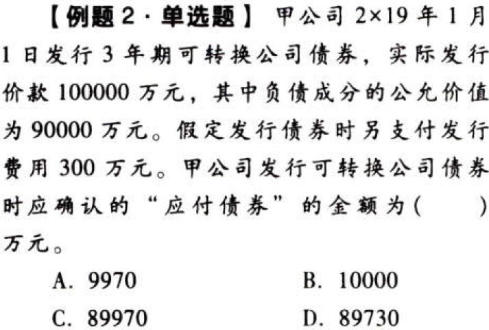
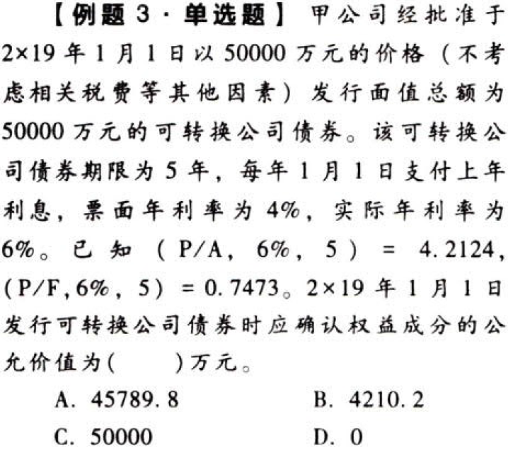

负债.流动负债+非流动负债.本章真题

# 1. 题目

【答案】
[查看解析和答案](media/10cc1ced0d75c13b6eb2056581b2e517.png.md)
# 2. 题目

【答案】
[查看解析和答案](media/e0b95c0a8e10747459a1195929de33bd.png.md)
# 3. 题目

【答案】
[查看解析和答案](media/1f469ea83fe08400810a3a69dff9e655.png.md)

