负债.职工薪酬.本章真题

# 1. 题目

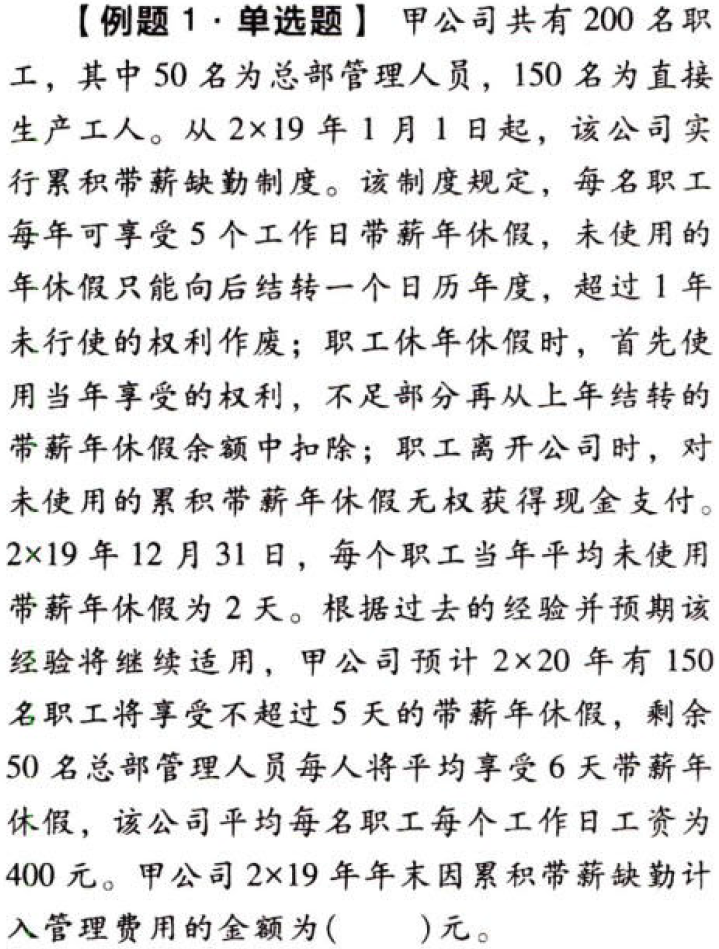

【答案】
[查看解析和答案](media/c42bbb028fe6f5cda3352a08753c008c.png.md)
# 2. 题目

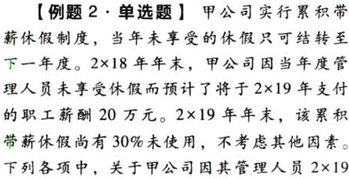

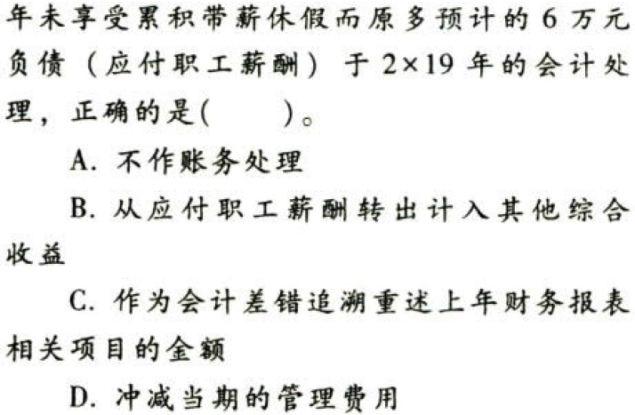

【答案】
[查看解析和答案](media/a5e2764376e8090abbd64ada02a3ac51.png.md)
# 3. 题目

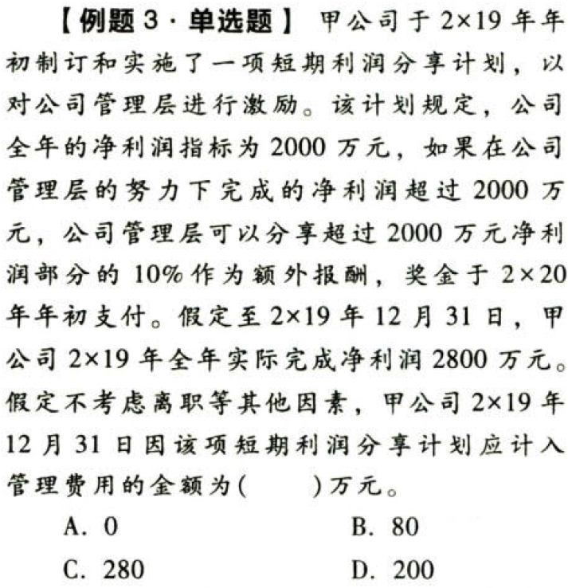

【答案】
[查看解析和答案](media/0c03f15a6e5d6d011468c9f5e7259592.png.md)
# 4. 题目

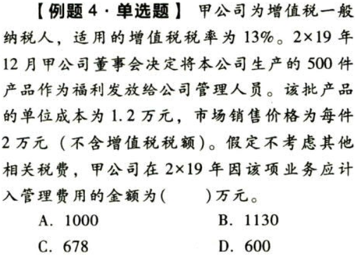

【答案】
[查看解析和答案](media/9a62d0a81459a3ce6b7883079cac6983.png.md)
# 5. 题目

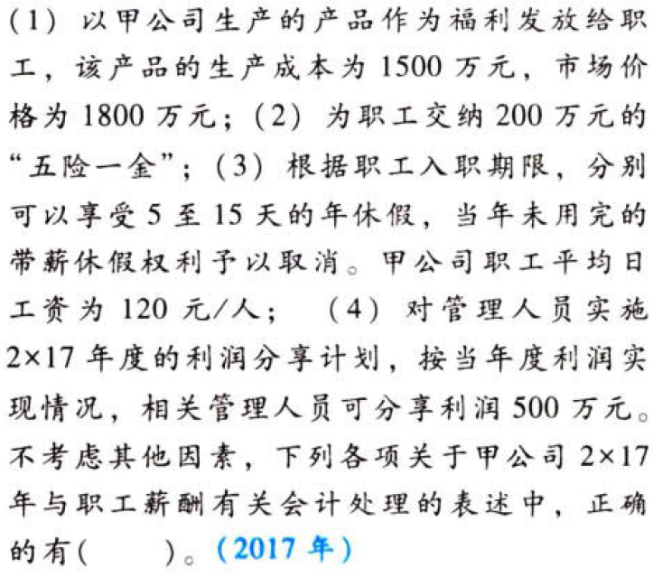

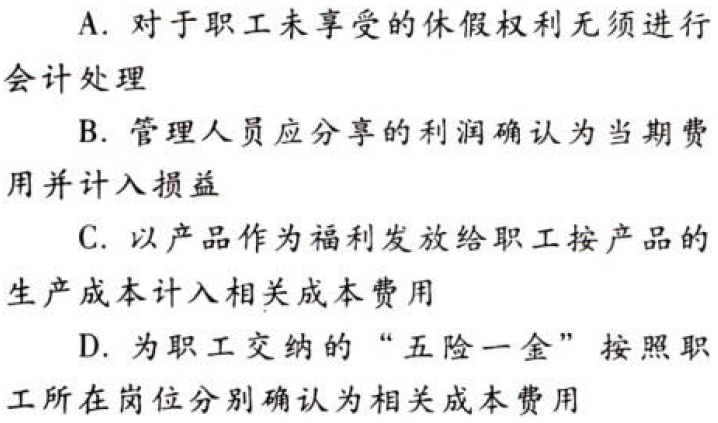

【答案】
[查看解析和答案](media/4292bbd0a4db5335251e433b86ea2de8.png.md)
# 6. 题目

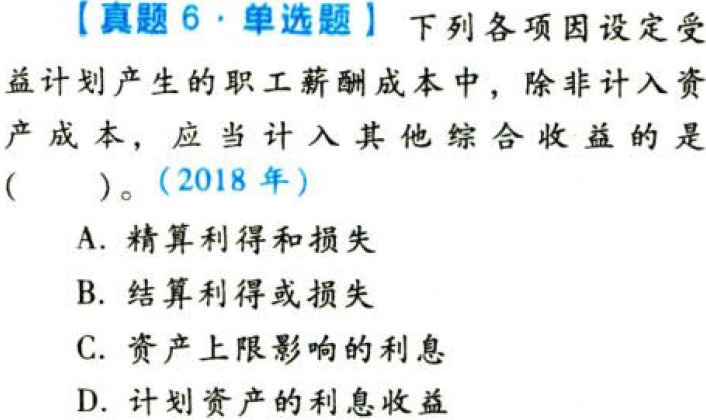

【答案】
[查看解析和答案](media/9576895dd7a4b7089c02c81fa60ea317.png.md)
# 7. 题目

【答案】
[查看解析和答案](media/e541257205bf3c4cdf9c3904154357e8.png.md)
# 8. 题目

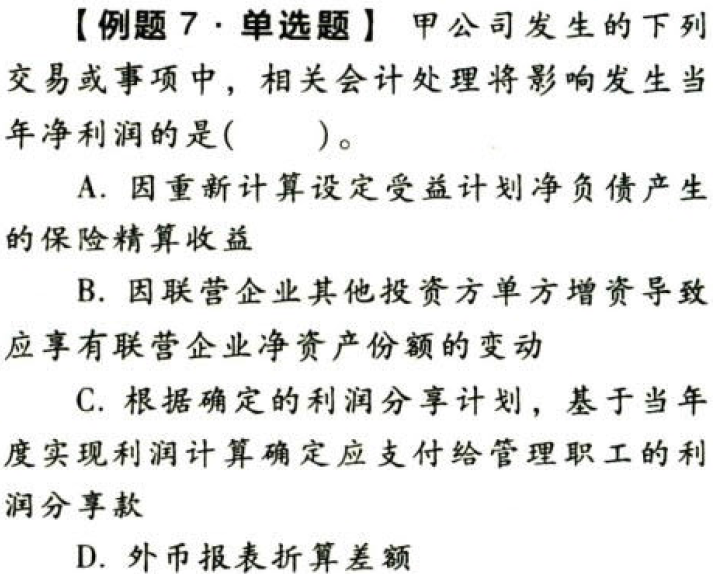

【答案】
[查看解析和答案](media/154c6a2be3337816cc16a3cc1dfca4b6.png.md)
# 9. 题目

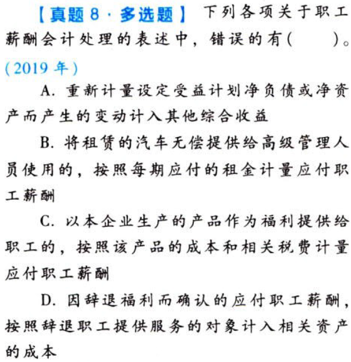

【答案】
[查看解析和答案](media/b2fb148b2f8821b0b8d6e96fe95b5fad.png.md)
# 10. 题目

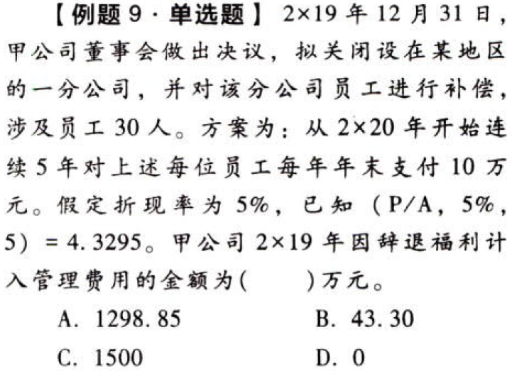

【答案】
[查看解析和答案](media/6f0ed64c9aa50bafbf35f28241b050a9.png.md)
# 11. 题目

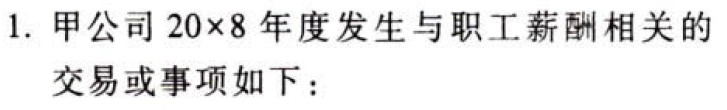

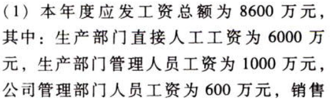

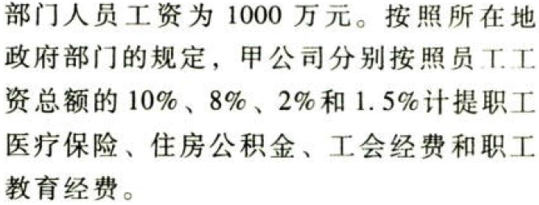

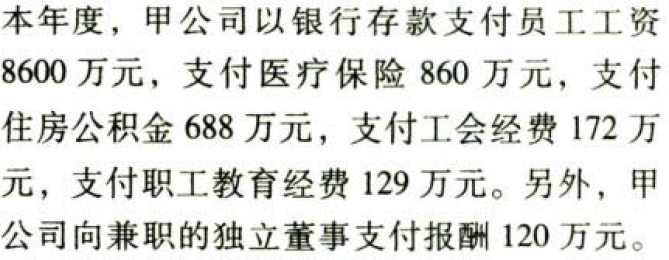

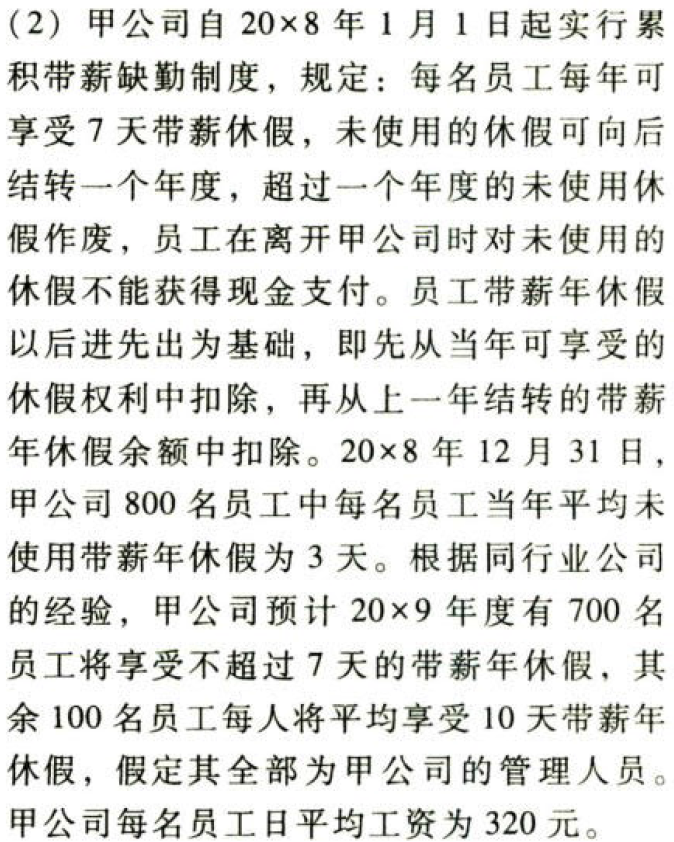

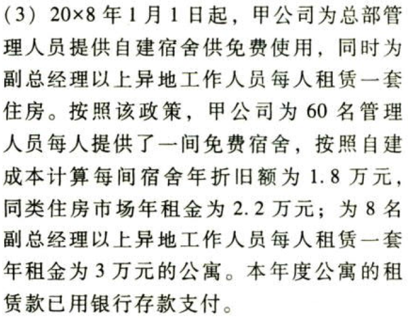

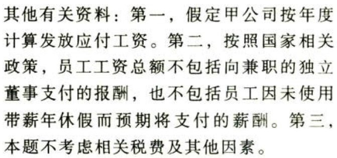

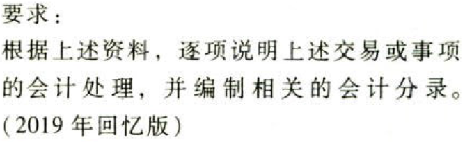

【答案】
[查看解析和答案](media/3d317beef2d720bfa40d1c61e333a723.png.md)
# 12. 题目

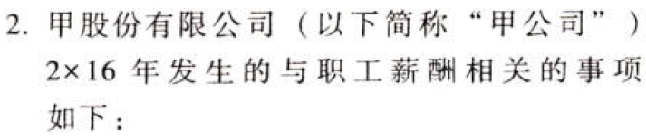

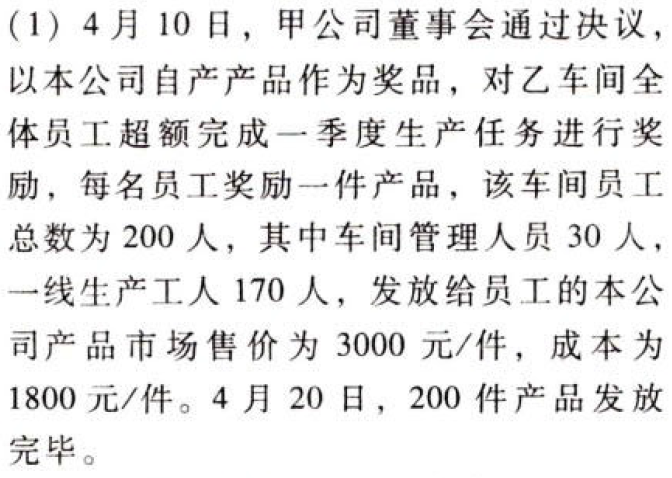

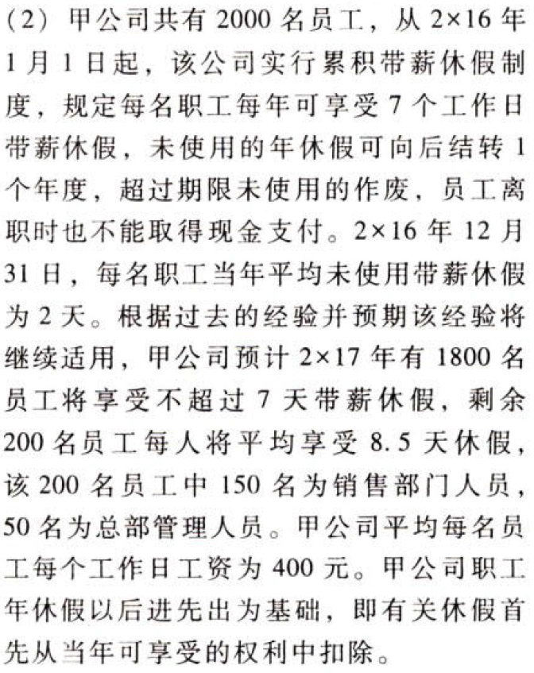

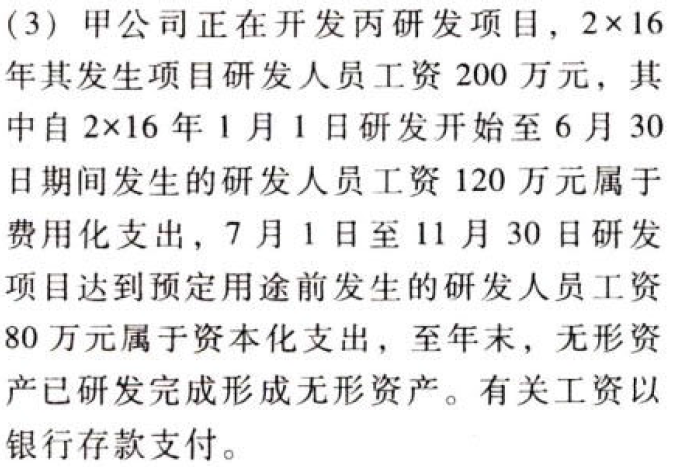

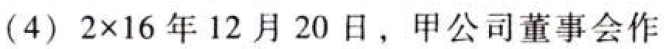

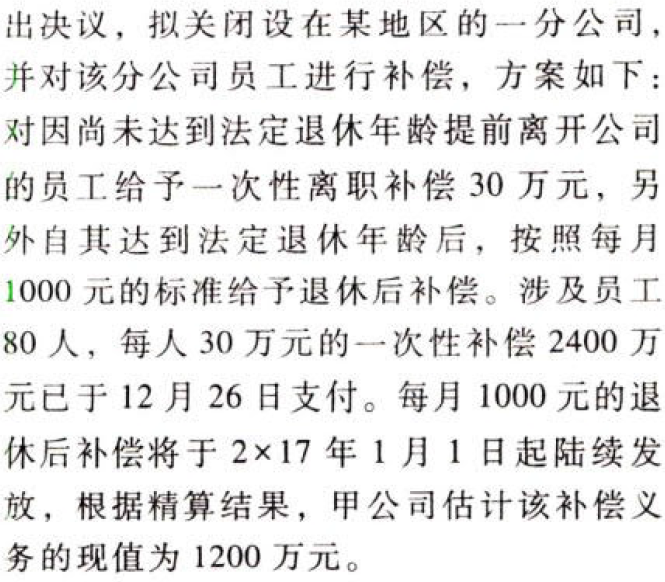

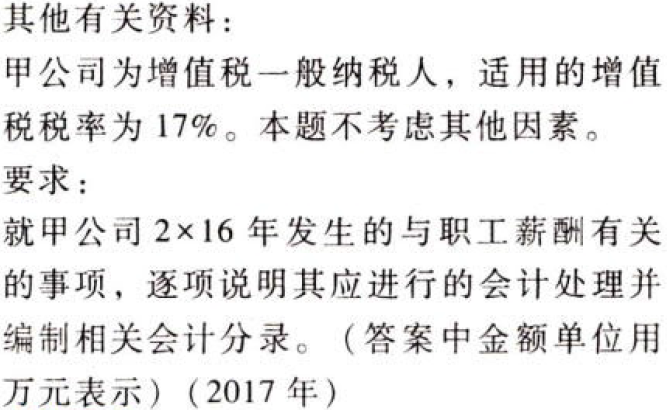

【答案】
[查看解析和答案](media/6982ebda90216fdce25e2efc32813865.png.md)

