资产.固定资产.本章真题

# 1. 题目

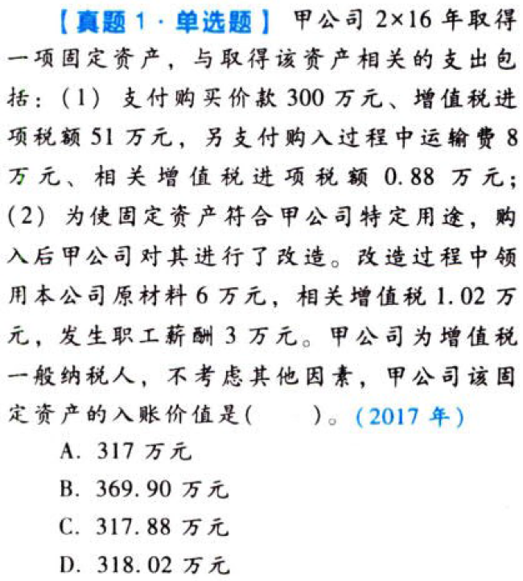

【答案】
[查看解析和答案](media/678a088b953a57ca08841b495c493df6.png.md)
# 2. 题目

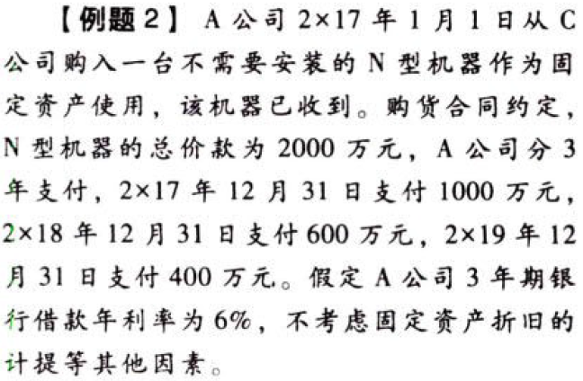

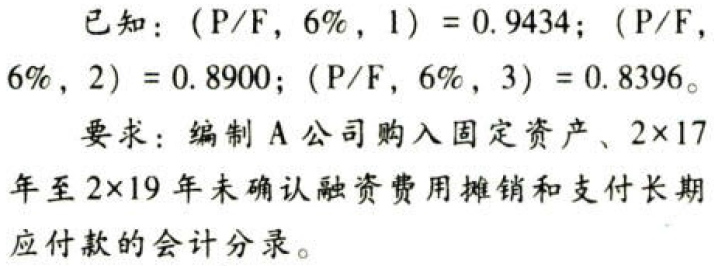

【答案】
[查看解析和答案](media/c832b83a5ef0842838bdd8d29b10c1bc.png.md)
# 3. 题目

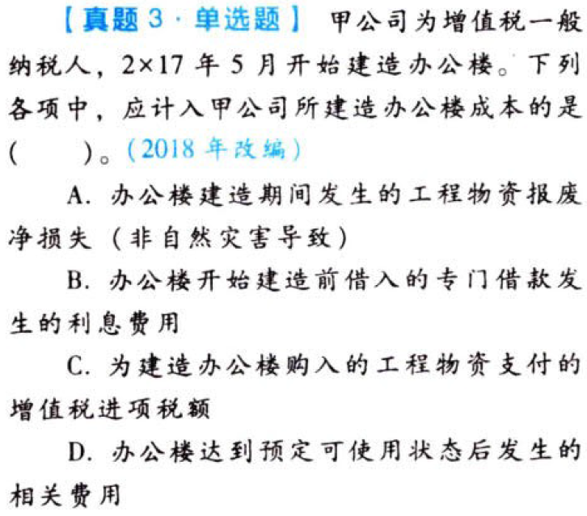

【答案】
[查看解析和答案](media/d0919491ee700973257ffbcd06185b0d.png.md)
# 4. 题目

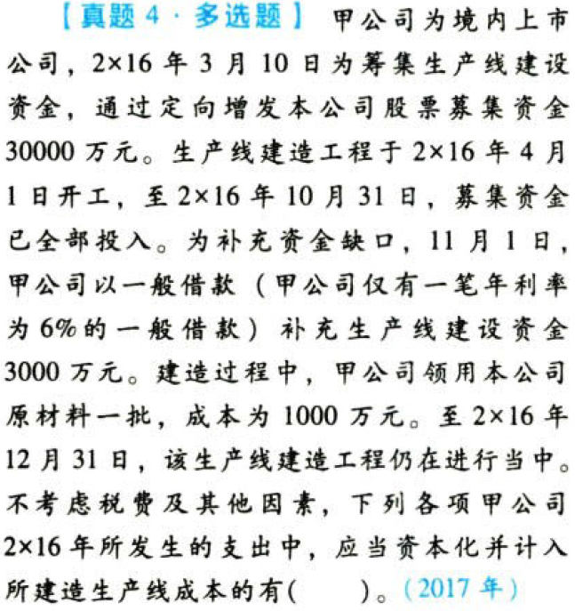

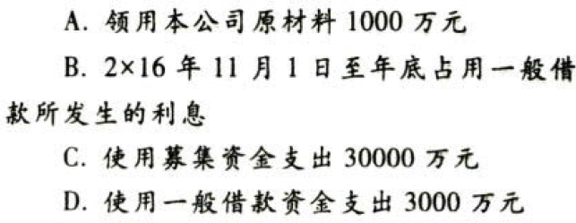

【答案】
[查看解析和答案](media/f5773eb6682b4b9bf122d59b5eda671e.png.md)
# 5. 题目

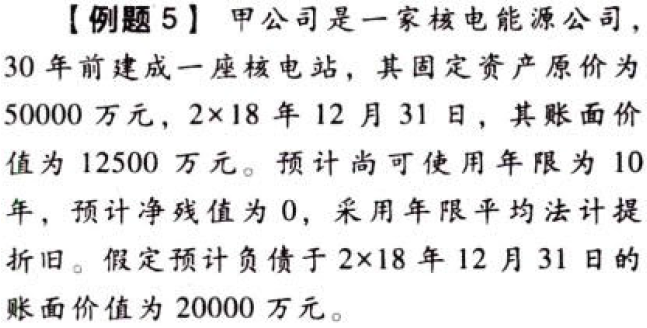

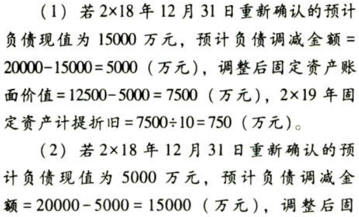

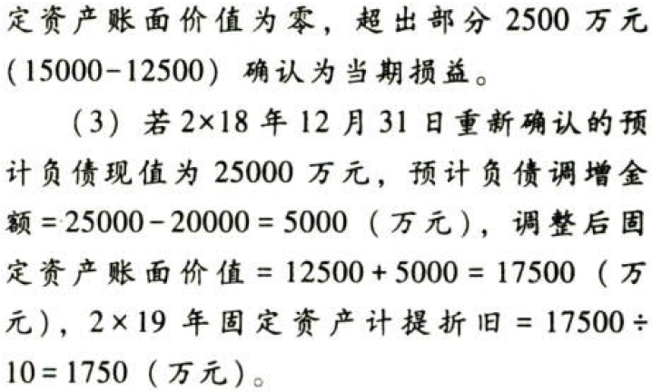

# 6. 题目

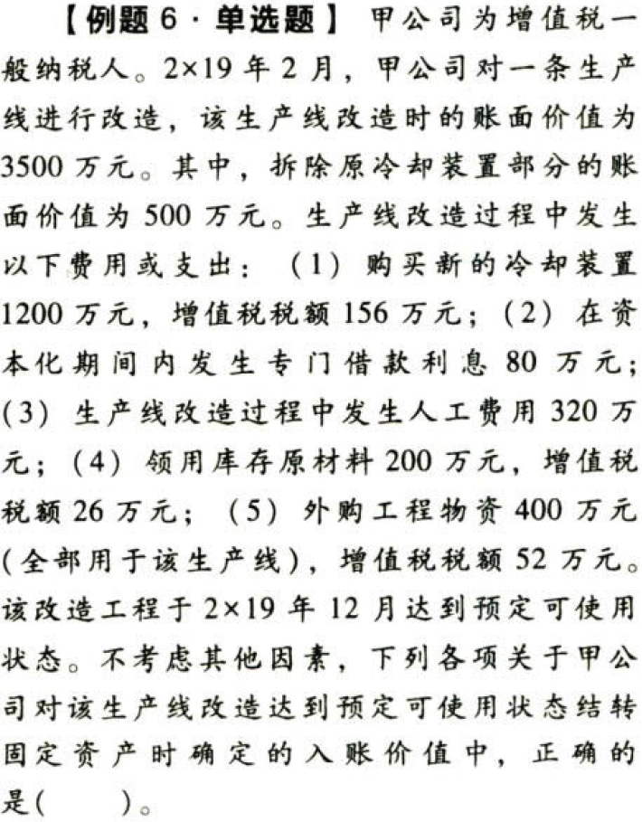

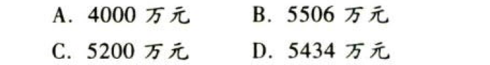

【答案】
[查看解析和答案](media/e18caaee4846cf10b01679c935036729.png.md)
# 7. 题目

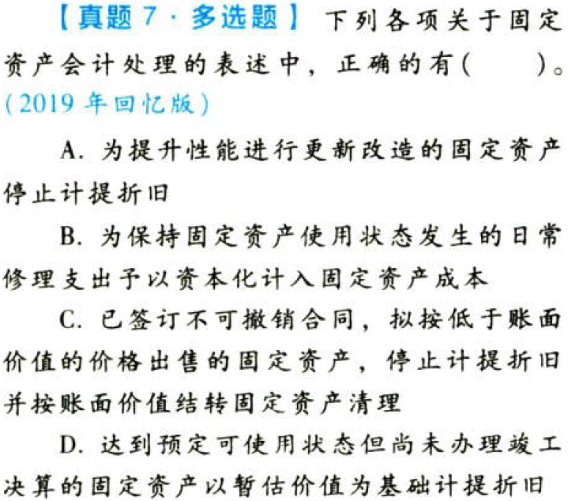

【答案】
[查看解析和答案](media/3630cc8da23757099769a45729af0943.png.md)

