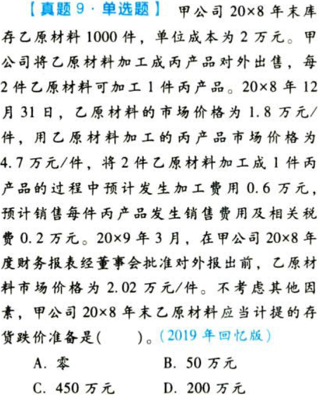

资产.存货本章真题

# 1. 题目

【答案】
[查看解析和答案](media/73f49b06eeb6b68165f07b75470e122c.png.md)
# 2. 题目

【答案】
[查看解析和答案](media/6abf0a83019e5acb2683262bd3176185.png.md)
# 3. 题目

【答案】
[查看解析和答案](media/36f629a5c01ce9b0c263d1025dabde2e.png.md)
# 4. 题目

【答案】
[查看解析和答案](media/ac2612788d33e8c0110a746b0862a1e0.png.md)
# 5. 题目

【答案】
[查看解析和答案](media/132618f320c5fa75b89ab30ad963fea7.png.md)
# 6. 题目

【答案】
[查看解析和答案](media/c2b4bb288fbd58003eb8a66dd2d53855.png.md)
# 7. 题目

【答案】
[查看解析和答案](media/7f8d8878eb47f07ef40e9a6dc52ed4a2.png.md)
# 8. 题目

【答案】
[查看解析和答案](media/f8eec0bd92dc64567f2d2157b650c861.png.md)
# 9. 题目

【答案】
[查看解析和答案](media/3b87deb686a0bf2457847295b05ed65a.png.md)
# 10. 题目

【答案】
[查看解析和答案](media/997acac1f5fb319db7b0b4aa43712fb5.png.md)
# 11. 题目

【答案】
[查看解析和答案](media/5624287bd7b12cd604ff148fae9e94c9.png.md)
# 12. 题目

【答案】
[查看解析和答案](media/54e13692ea3692805d7e44b76dc9eab1.png.md)
# 13. 题目

【答案】
[查看解析和答案](media/1e7e67456853cf00e03f2498f8b662af.png.md)
# 14. 题目

【答案】
[查看解析和答案](media/4eed716248c45aeee864d55b3b8da88e.png.md)

