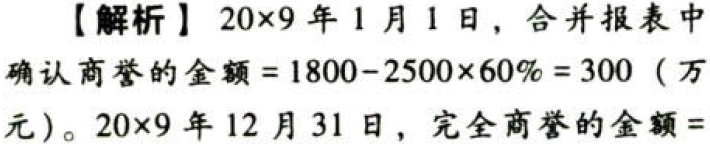

资产.资产减值.本章真题

# 1. 题目

【答案】
[查看解析和答案](media/2415e969781482c6e0679efbb0494a6a.png.md)
# 2. 题目

【答案】
[查看解析和答案](media/ca1f8fb1313e562224aed0268ebda254.png.md)
# 3. 题目

【答案】
[查看解析和答案](media/03051b56b33ba7972c0f265ab8466e7d.png.md)
# 4. 题目

【答案】
[查看解析和答案](media/7b07a769f1a81c5fcf5d6d310bd238b6.png.md)
# 5. 题目

【答案】
[查看解析和答案](media/f53c244a5e8808aa98f4a55c93982a1a.png.md)
# 6. 题目

【答案】
[查看解析和答案](media/e011a3d904167e75abd1346a67216eea.png.md)
# 7. 题目

# 8. 题目

【答案】
[查看解析和答案](media/3f5747af38dafaf0b2c9bef8d57faac5.png.md)
# 9. 题目

# 10. 题目

【答案】
[查看解析和答案](media/006d8fdc637caeea374205b1109c58d5.png.md)

