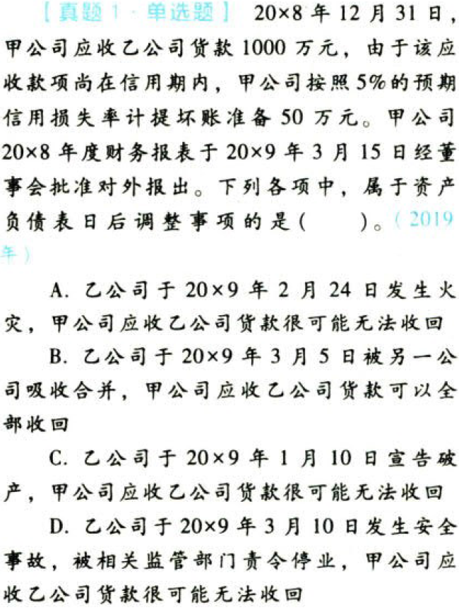
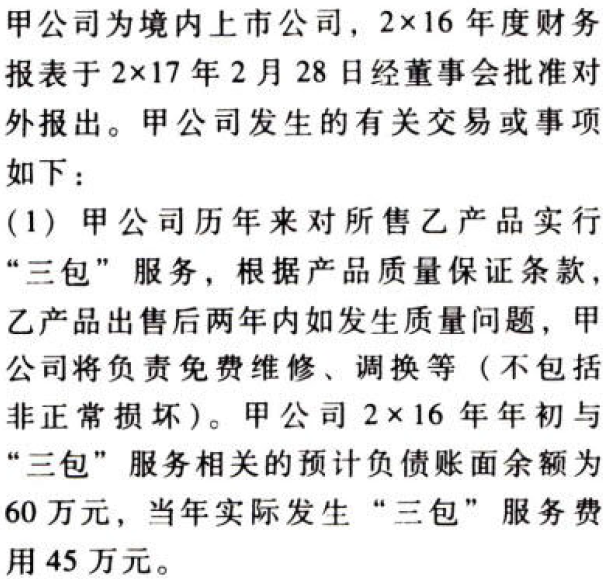

资产负债表日后事项.本章真题

# 1. 题目

【答案】
[查看解析和答案](media/1ff9a7a7a4ea3b79ab92214c3ceedbf8.png.md)
# 2. 题目

【答案】
[查看解析和答案](media/65cfeab428f27e7f9f4cdfbc57715aee.png.md)
# 3. 题目

【答案】
[查看解析和答案](media/58ffa84b830e296b08be3d0af0b8d5bb.png.md)
# 4. 题目

【答案】
[查看解析和答案](media/8edea1c51bf944870120c484219cd4d2.png.md)
# 5. 题目

【答案】
[查看解析和答案](media/e956b9bf530af6b94b22e73fec7450a8.png.md)
# 6. 题目

【答案】
[查看解析和答案](media/673104600a33be9ca7ab017de2f3aa6e.png.md)
# 7. 题目

【答案】
[查看解析和答案](media/b14c2ecd1a8e1f561986f28f54520723.png.md)

