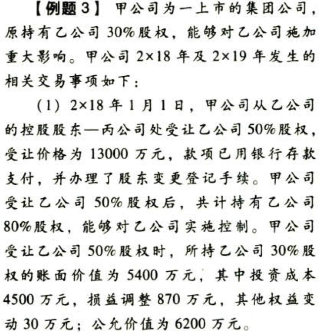
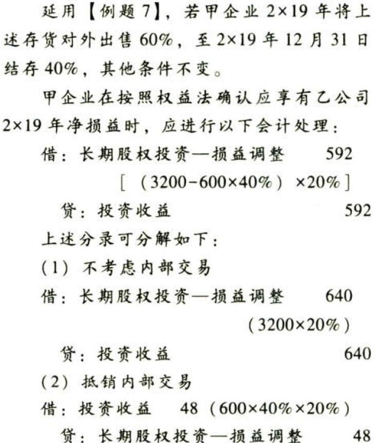
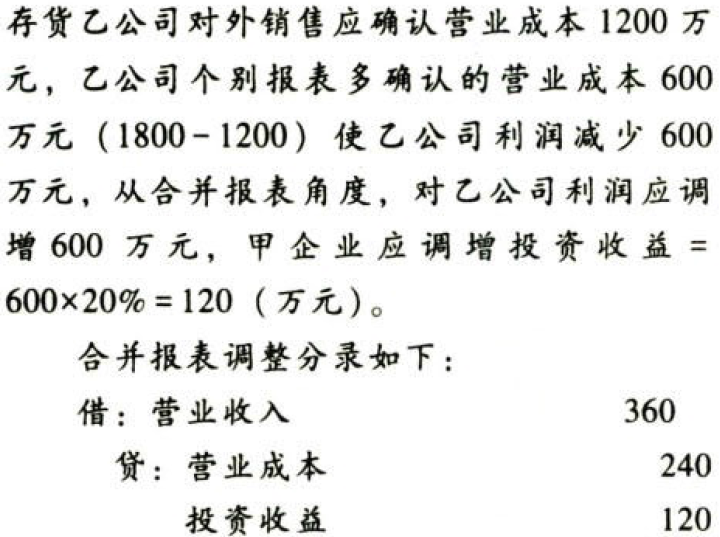
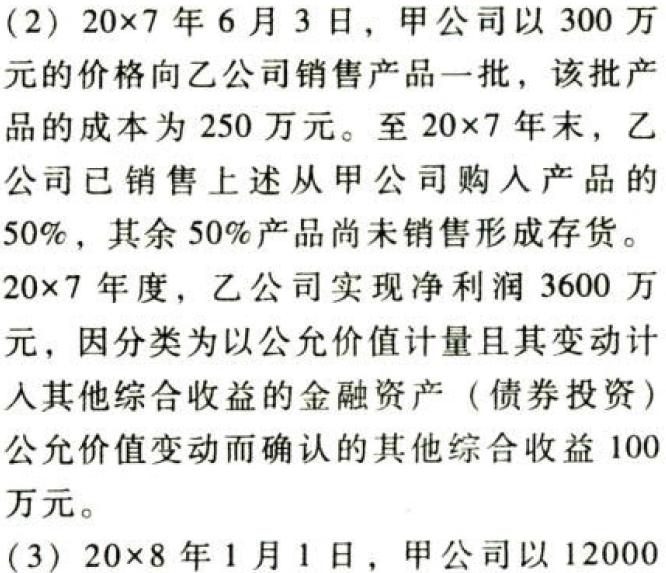

资产.长期股权投资.本章真题

# 1. 题目

【答案】
[查看解析和答案](media/7fab7bad9002c0b3a5edaf9539c84ebf.png.md)
# 2. 题目

【答案】
[查看解析和答案](media/1c8179bffe8939d641a41a7376230472.png.md)
# 3. 题目

【答案】
[查看解析和答案](media/3e2809ca2dfc72b23cfc5a5a9e4b2ec4.png.md)
# 4. 题目

【答案】
[查看解析和答案](media/0082a967b7fd76114be01a707cc2d15a.png.md)
# 5. 题目

# 6. 题目

【答案】
[查看解析和答案](media/f6f7cbeac96a627c7a6cd29206825e0a.png.md)
# 7. 题目

【答案】
[查看解析和答案](media/7308ef9178373cf4097c58259efa2040.png.md)
# 8. 题目

【答案】
[查看解析和答案](media/2db843ad6aa883e1e8067cf83a23fff6.png.md)
# 9. 题目

【答案】
[查看解析和答案](media/1bd851cf64ac727d9d74312b9505f365.png.md)
# 10. 题目

【答案】
[查看解析和答案](media/13c180f0631ee0b2f251af963edc18fa.png.md)
# 11. 题目

# 12. 题目

# 13. 题目

# 14. 题目

# 15. 题目

# 16. 题目

# 17. 题目

# 18. 题目

【答案】
[查看解析和答案](media/c050bffa2596ac0de7c5dc8a3ad29599.png.md)
# 19. 题目

# 20. 题目

# 21. 题目

【答案】
[查看解析和答案](media/e8d22659ff99f6ba5d2313e4c093fe99.png.md)
# 22. 题目

【答案】
[查看解析和答案](media/9dd95c4e97fffbfbc94f04549053949b.png.md)
# 23. 题目

【答案】
[查看解析和答案](media/1879411c4fd4d7fd413689ab80be6e2f.png.md)
# 24. 题目

【答案】
[查看解析和答案](media/e3c6167e65ee93cbb7f3e3b6284521f9.png.md)
# 25. 题目

【答案】
[查看解析和答案](media/36f76128ceed79024b44b8df9b1a8447.png.md)

